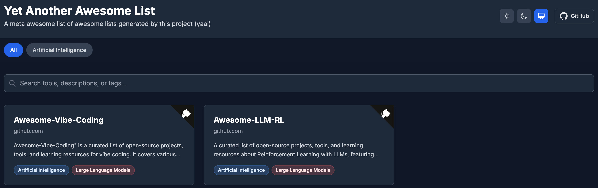

# Yet Another Awesome List

A meta awesome list of awesome lists generated by this project (yaal)

🌐 **Live Website**: [https://0xWelt.github.io/yaal/](https://0xWelt.github.io/yaal/)

## Table of Contents

- [Table of Contents](#table-of-contents)
- [Artificial Intelligence](#artificial-intelligence)
  - [Large Language Models](#large-language-models)
    - [Awesome-Vibe-Coding](#awesome-vibe-coding)
    - [Awesome-LLM-RL](#awesome-llm-rl)
- [Repo Status](#repo-status)
- [Contributors](#contributors)
- [Star History](#star-history)
- [License](#license)

## Artificial Intelligence

> Curated collection of AI-related awesome lists covering artificial intelligence tools, resources, and learning materials.

### Large Language Models

> Resources and tools specifically focused on large language models and AI-assisted development workflows.

#### [Awesome-Vibe-Coding](https://github.com/0xWelt/Awesome-Vibe-Coding)

"Awesome-Vibe-Coding" is a curated list of open-source projects, tools, and learning resources for vibe coding. It covers various categories including development toolkits, web-based IDEs, cloud-based agents, and learning resources, aiming to facilitate modern software development with AI assistance.

#### [Awesome-LLM-RL](https://github.com/0xWelt/Awesome-LLM-RL)

A curated list of open-source projects, tools, and learning resources about Reinforcement Learning with LLMs, featuring frameworks like OpenRLHF built on Ray, vLLM, ZeRO-3 and HuggingFace Transformers.

## Repo Status

## Contributors

This project exists thanks to all the people who contribute.

## Star History

## License

This work is licensed under a
[Creative Commons Attribution 4.0 International License](http://creativecommons.org/licenses/by/4.0/).
